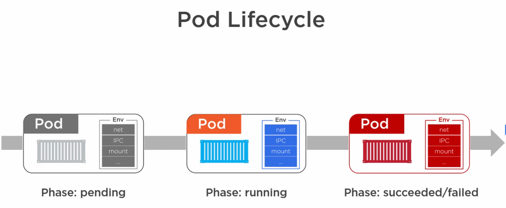

#### Kubernetes-fundamentals

#### Useful Resources
- https://www.udacity.com/course/scalable-microservices-with-kubernetes--ud615
- https://app.pluralsight.com/course-player?clipId=a9878a2f-3dec-4a24-8ebe-b89f1cc94410
- https://medium.com/swlh/choreography-inside-kubernetes-aa5fcf69ac65
- https://www.codetd.com/en/article/8324718
- https://medium.com/@tsuyoshiushio/kubernetes-in-three-diagrams-6aba8432541c
- https://theithollow.com/2019/02/05/kubernetes-service-publishing/
- https://medium.com/@tsuyoshiushio/kubernetes-in-three-diagrams-6aba8432541c
- https://medium.com/swlh/choreography-inside-kubernetes-aa5fcf69ac65
- https://www.slideshare.net/harryzhang735/kubernetes-beyond-a-black-box-part-1
- https://medium.com/dev-genius/kubernetes-namespaces-core-concepts-488bb473aaee

#### Key points

1. Born in Google
2. Donated to CNCF (cloud native computing foundation) in 2014 (open source)
3. Written in Go/Golang
4. Kubernetes Github repo - https://github.com/kubernetes/kubernetes
5. Kubernetes is all about managing containers at scale.
6. Also known as K8s - 8 represents 8 characters between K and s in Kubernetes.
7. An Orchestrator for Microservice Apps

#### Kubernetes Architecture and components

 
 

 
 

 
 

 
 

 
 

 
 

 
 

 
 

 
 

 
 

 
 
#### Declarative model and Desired state
  
 
 
  
 
 
 
 
 
 
 
 
#### Pod
- In VMware world, atomic unit of deployment is VM.
- In Docker world, atomic unit of deployment is container.
- In Kubernetes world, atomic unit of deployment is Pod.
- Kubernetes runs containers always inside a Pod.

#### Unit of scaling in Kubernetes is also Pod. If you want to scale a component then you do it by adding Pod.

#### We cannot have single Pod running across multiple nodes.

#### Pods are atomic.

#### Pods lifecycle

- Pods are born, live and die.
- Pod after die can not be brought back to life.
- New Pod may look like earlier died pod.
- Pods are deployed via deployments.
- It is possible to deploy Pod directly by giving API server A Pod Manifest file which is YAML file and contains desired state.
This file is validated by API server and then API server ranks Kubernetes cluster nodes and then deploys Pod to one of nodes
which satisfy the requirement.
- Pods are also deployed by Replication Controller.
- Replication controllers have been replaed by Replica Sets in updated version of Kubernetes.

#### Services
- labels tie together services and pods.
- services and Pods having same label get tied together.

#### Deployments

#### Installing Kubernetes

#### installation on windows
- enable hyper-v on windows
- install `kubectl` using link `https://kubernetes.io/docs/tasks/tools/install-kubectl/`
- Install `minikube` using an installer executable using link `https://kubernetes.io/docs/tasks/tools/install-minikube/`
- execute command `minikube start` in power shell
- after setup, execute following command to validate the set up `kubectl get nodes`

#### installation on Google Cloud Platform
- Refer link `https://cloud.google.com/kubernetes-engine/docs/how-to/creating-a-cluster`

#### installation on AWS
- Refer link `https://kubernetes.io/docs/setup/production-environment/turnkey/aws/`

#### Manual installation
- Refer link `https://kubernetes.io/docs/setup/production-environment/tools/kubeadm/install-kubeadm/`

#### Installation summary

#### kubernetes useful commands
- `kubectl get nodes`
- `minikube dashboard`
- `kubectl describe pods`
- `kubectl get pods` 
- `kubectl apply -f pod-manifest-1.yml` (file name here could be any meaningful name depicting pod manifest file) 
Here, `kubectl` will talk to API server and send this manifest file which will then be
stored in etcd data store and scheduler will assign this pod to one of K8s nodes.

- `kubectl cluster-info` 
- `kubectl describe pods <pod-name>`
- `kubectl delete pod <pod-name>`
- `kubectl delete -f pod-manifest-1.yml`
-  `kubectl expose pod <pod-name> --name=<service-name> --target-port=<container-port> --type=NodePort`
- `kubectl get svc`
- 

#### Working with Pods

#### example of pod manifest yml file

 

#### Following section explains how to talk to Pods

#### services can handle this type of communication (from external world and from inside cluster)
- cluster ip is automatically assigned by K8s
- there is cluster dns name corresponding to cluster ip
- every container in every pod knows about cluster dns
- when we are talking about service, cluster ip is associated with it.
- every service is also assigned a network port.
- 

#### Following example explains how to expose Pod via a Service using Command line
- here, name of the pod is `hello-pod`
- name of service we are providing is `hello-svc`
- container is running on port 8080

#### Following example explains how to expose Pod via a Service using declarative way

- kubernetes service can be of 3 type - ClusterIP, NodePort and LoadBalancer
- ClusterIP is default one (used for internal cluster connectivity). ClusterIP only makes service available inside K8s cluster.
- NodePort - External access via nodes
- LoadBalancer - External access via cloud load balancer

